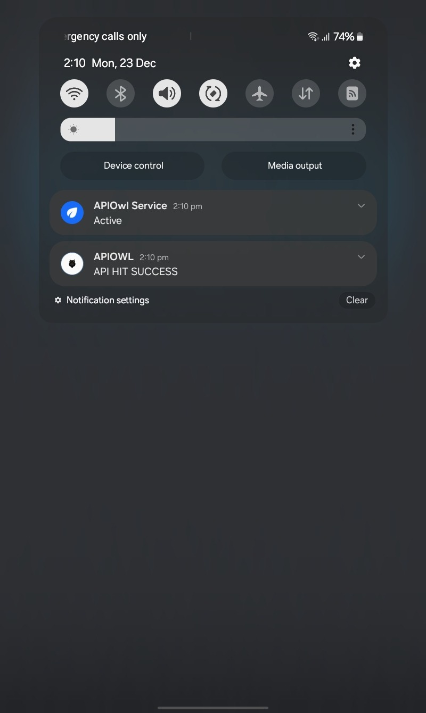

# Apiowl

 <!-- Replace with your app's logo if available -->

Apiowl is a powerful Flutter app designed to keep APIs awake by sending requests at regular intervals. With an intuitive interface and a sleek design inspired by Discord, Apiowl ensures your APIs stay active without requiring manual intervention.

## Features

- **Background Service**: Keeps APIs awake by sending requests at specified intervals, even when the app is in the background.
- **Customizable Settings**:
  - API URL: Input the URL of the API to monitor.
  - Interval: Set the time interval between requests.
- **Notifications**: Displays local notifications for API call results (success or error).
- **Dark-Themed UI**: A visually appealing interface with a color scheme inspired by Discord.
- **Easy Control**: Start and stop the background service with a single tap.

## Screenshots

<!-- Add screenshots of the app -->
<div style="display: flex; gap: 10px; align-items: center;">
  
  


 

</div>  

## Getting Started

### Prerequisites

- Flutter SDK (version >= 3.0.0)
- Dart (version >= 3.0.0)

### Installation

1. Clone the repository:
   ```bash
   git clone https://github.com/SRAYANSH-GUPTA/ApiOwl.git
   cd apiowl
